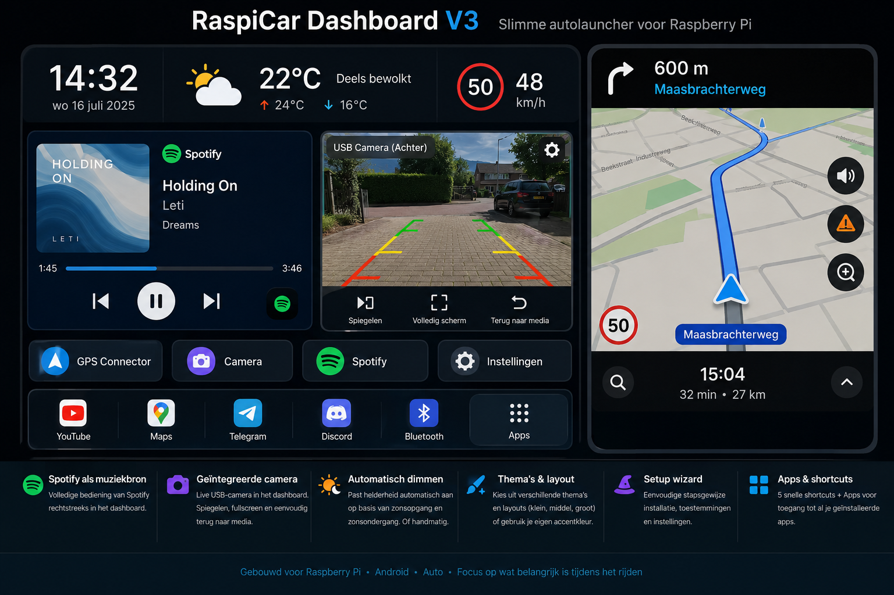

# RaspiCar Dashboard V4

Custom landscape launcher/dashboard for Android and Raspberry Pi 5 with LineageOS. The main target is a 1280×800 HDMI touchscreen with RaspiCar on the left and Waze on the right, while adaptive Compact, Medium and Large profiles support other window sizes.

> The image is the V3 visual reference. V4 keeps this layout and adds the media-volume row, local music source and new camera sizing controls.

## V4 highlights

- Waze remains on the right and is not forced open again after the user closes it.
- A universal draggable **Return to dashboard** overlay is shown for external apps opened from RaspiCar.
- GPS Connector is optional; devices with built-in Android GPS can skip it.
- Spotify and a built-in local audio player are selectable media sources.
- Local music is read only from a folder chosen through Android's Storage Access Framework.
- Device media-volume slider between the media/camera card and fixed app buttons.
- Camera preview keeps its aspect ratio instead of stretching.
- Camera display mode: fit entire image or fill/crop.
- Camera aspect preference: automatic, 4:3 or 16:9.
- Adjustable camera preview width from 45% to 100% of the media panel.
- Five configurable shortcuts plus a permanent Apps drawer.
- Embedded USB-camera preview, weather, GPS speed, themes and sun-based dimming.

## Media sources

Tap the source label above the player to cycle through:

- **Spotify** — follows only Spotify's Android MediaSession.
- **Local music** — uses RaspiCar's built-in background audio player.
- **Automatic** — prefers whichever supported source is actively playing.

For Spotify metadata and controls, enable RaspiCar's notification-listener access.

For local music, open **Settings → Local music folder and library**, choose a folder on internal storage, SD card or USB storage, then tap a track. RaspiCar keeps persistent read access only to the selected folder; broad all-files permission is not used.

## Universal return overlay

External apps launched from:

- fixed app buttons;
- user shortcuts;
- the Apps drawer;
- Spotify;
- GPS Connector;
- Android system settings opened through RaspiCar;

receive a draggable return button when overlay permission is enabled. The button snaps to the nearest screen edge. Tapping it returns to RaspiCar without automatically reopening Waze.

Some protected Android screens may hide overlays by design.

## GPS source

Choose one of these during setup or in Settings:

- **Built-in Android GPS** — no GPS Connector requirement.
- **External GPS via GPS Connector** — useful for the Garmin receiver on the Raspberry Pi.

Weather, speed and sun-based dimming use the Android location stream in both modes.

## Camera

RaspiCar uses Android Camera2. A USB/UVC camera should be available when LineageOS exposes it through Android's camera provider.

Settings include:

- camera selection with live preview;
- mirror on/off;
- rotation 0°, 90°, 180° or 270°;
- fit or fill/crop;
- automatic, 4:3 or 16:9 aspect preference;
- preview width from 45% to 100%.

The camera is opened only while Camera mode is visible and is released when returning to media.

## Volume

The dashboard volume slider controls Android's `STREAM_MUSIC` volume. It applies to Spotify, RaspiCar local music and other apps using the normal media audio stream. Tap the speaker icon to mute and restore the previous volume.

## Waze behaviour

Waze can open once when the dashboard starts. It is intentionally not forced back every time RaspiCar resumes.

If the user closes Waze, it remains closed. Use **Open Waze** to restore it. Android/LineageOS controls the final split position; RaspiCar requests Waze on the right with roughly 65% of the full display.

## Automatic dimming

Dimming modes:

- Off
- Manual percentage
- Automatic day/night levels based on sunrise and sunset at the last known location

The dim layer is touch-through. On an HDMI display it darkens the rendered image but does not physically reduce the panel backlight.

## Building with GitHub Actions

The workflow artifact is:

`RaspiCarDashboard-v4-debug`

The APK inside is:

`app-debug.apk`

See [BUILD_WITH_GITHUB.md](BUILD_WITH_GITHUB.md) and [SIGNING_WITH_GITHUB.md](SIGNING_WITH_GITHUB.md).

V4 keeps the same application ID and persistent-signing support introduced for V3. When the same GitHub signing secrets are used, V4 should install directly over the persistently signed V3 build.
