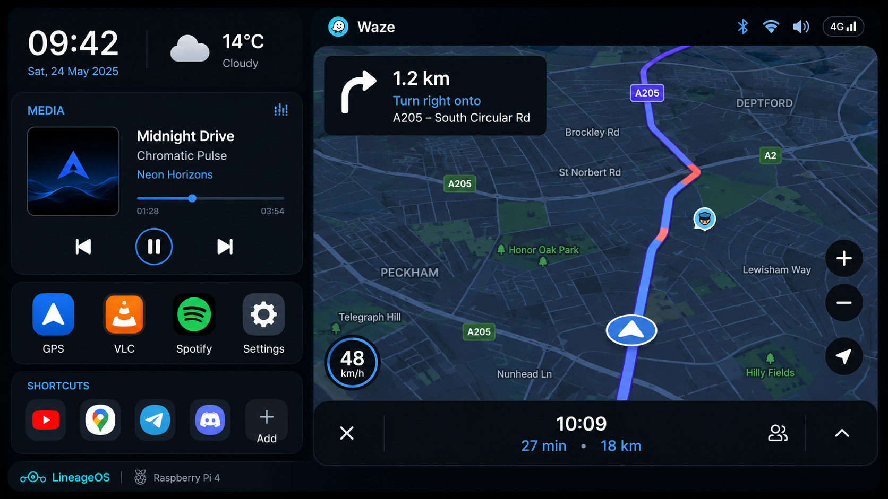

# RaspiCar Dashboard — V1

Een custom landscape Android-launcher voor:

- Raspberry Pi 5
- LineageOS `23.2-20260520-UNOFFICIAL-KonstaKANG-rpi5`
- GeeekPi 10.1-inch HDMI touchscreen
- 1280×800



## V1-functies

- Dashboard als Android **Home/launcher**.
- Opent Waze automatisch als aangrenzend split-screenvenster, bedoeld voor **dashboard links / Waze rechts**.
- Probeert een verhouding van ongeveer **35% dashboard / 65% Waze** aan te vragen.
- Optioneel: GPS Connector kort openen voordat Waze start.
- Tijd en Nederlandse datum.
- Huidige snelheid via Android Location/GPS Connector.
- Huidig weer via Open-Meteo en de GPS-locatie.
- Universele Android MediaSession-widget voor onder andere Spotify, VLC en lokale mediaspelers:
  - titel en artiest;
  - albumhoes;
  - vorige, play/pauze en volgende;
  - voortgang.
- Vaste knoppen voor Waze/GPS, VLC, Spotify en de eigen instellingen.
- Zes vrije app-slots:
  - leeg slot toont `+`;
  - tik om een geïnstalleerde app te kiezen;
  - lang indrukken en naar de prullenbak slepen om het slot leeg te maken.
- Eigen instellingen met een aparte knop naar de volledige Android-instellingen.
- Optionele zwarte software-dimlaag over het volledige HDMI-beeld, inclusief Waze.

## Belangrijke beperking van Android split-screen

De app gebruikt `FLAG_ACTIVITY_LAUNCH_ADJACENT` en geeft Waze rechter schermgrenzen mee. Android/LineageOS beslist uiteindelijk zelf over de vensterpositie en dividerverhouding. Wanneer LineageOS de 35/65-aanvraag negeert, sleep je de divider één keer handmatig naar de gewenste positie. Veel builds onthouden de laatste verdeling.

Er is voor V1 geen root nodig. Wanneer KonstaKANG de adjacent-launch anders verwerkt dan standaard Android, kan in V1.1 een build-specifieke root/shell-fallback worden toegevoegd nadat we het gedrag op het echte scherm hebben gezien.

## Bouwen

Gebruik Android Studio Quail 2 / 2026.1.2 of nieuwer.

Vereisten:

- JDK 17 of nieuwer;
- Android SDK Platform 36;
- Android SDK Build Tools 36.0.0;
- internet tijdens de eerste Gradle-sync.

1. Open deze map als project in Android Studio.
2. Laat Gradle synchroniseren.
3. Kies **Build → Build APK(s)**.
4. De debug-APK verschijnt onder `app/build/outputs/apk/debug/app-debug.apk`.

Het project gebruikt Android Gradle Plugin 9.2.1. Volgens de officiële compatibiliteit gebruikt AGP 9.2 standaard Gradle 9.4.1 en Build Tools 36.0.0.

## Installeren

Via ADB:

```bash
adb install -r app-debug.apk
```

Daarna op de Raspberry Pi:

1. Open **RaspiCar Dashboard**.
2. Sta locatie toe.
3. Open de gear → **Mediatoegang instellen** en schakel RaspiCar media access in.
4. Voor HDMI-dimming: gear → **Toestemming voor dimlaag**.
5. Gear → **Als standaard Home-app kiezen** → RaspiCar Dashboard.
6. Controleer dat Waze, GPS Connector, VLC en Spotify geïnstalleerd zijn.

## Eerste autotest

Controleer vooral:

- opent Waze werkelijk rechts;
- blijft het dashboard links staan;
- onthoudt LineageOS de dividerpositie;
- start GPS Connector zonder vervelende zichtbare vertraging;
- ontvangt de snelheidsmeter de mock GPS-locatie;
- toont Spotify/VLC metadata na het geven van mediatoegang;
- blijft de dimoverlay klik-doorlatend.

## Package ID

`nl.roy.raspicardashboard`
